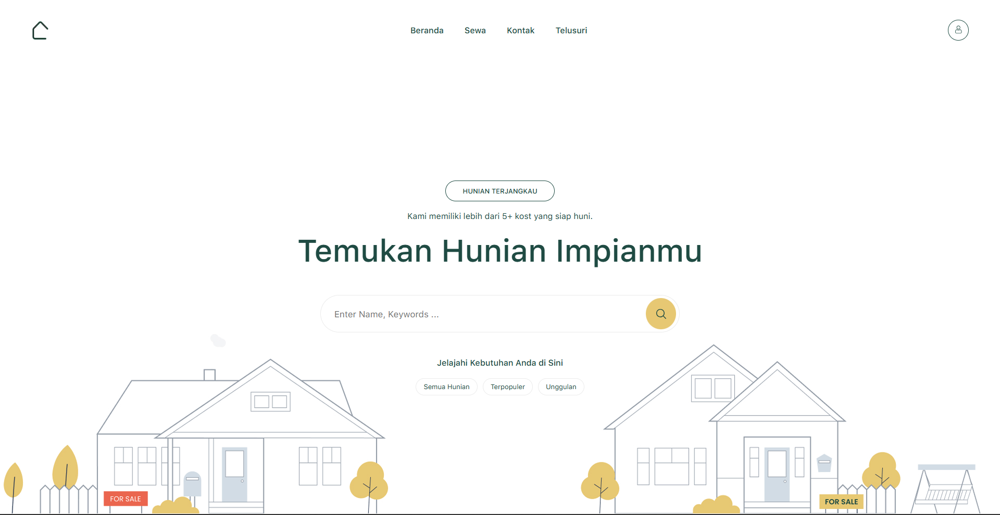

<div align="center">
<a href="https://github.com/fahmirizalbudi/kostopia" target="blank">

</a>

<br />
<br />


</div>

<br />

## Kostopia

Kostopia is a web and mobile application for renting boarding houses, rental houses, or rental housing. Built with Go to provide a backend, Next.js as the web application and Flutter for a mobile application. Key features include:

## Preview



## Features

- **Advanced Search & Filter:** Easily find rooms based on specific criteria such as location, price range, facilities, and type.
- **Interactive Maps:** View boarding house locations directly on an integrated map for better navigation.
- **Easy Booking:** Schedule site visits or book rooms directly through the application.
- **Reviews & Ratings:** Read honest reviews from previous tenants to make informed decisions.
- **Property Management:** Add and update room details, upload photos, and manage facilities easily.
- **Tenant Management:** Keep track of active tenants, rental periods, and due dates.

## Tech Stack

- **Next.js & TypeScript**: Used for the web platform, providing server-side rendering and type safety.
- **Sass**: For modular and advanced CSS styling.
- **Go**: A statically typed programming language designed for building scalable and high-performance server-side applications.
- **Gin**: A high-performance web framework for Go, designed for building RESTful APIs and web applications.
- **Flutter**: Used for the cross-platform mobile application (Android & iOS).
- **PostgreSQL**: A powerful, open-source relational database system for storing and managing structured data.
- **Redis**: An in-memory data structure store, used as a database, cache, and message broker to improve API performance.
- **Midtrans**: Integrated payment gateway for handling secure transactions.

## Getting Started

To get a local copy of this project up and running, follow these steps.

### Prerequisites

- **Go** (v1.24.x or higher).
- **Dart** (v.3.8.1 or higher) & **Flutter SDK**.
- **Node.js** & **NPM**.
- **PostgreSQL** (or another supported SQL database).
- **Redis** (latest stable version).

## Installation

1. **Clone the repository:**

   ```bash
   git clone https://github.com/fahmirizalbudi/kostopia.git
   cd kliklelang
   ```

2. **Install dependencies:**

   ```bash
   #api
   cd api
   go mod tidy

   #app
   cd app
   flutter pub get

   #web
   cd web
   npm install
   ```

3. **Start the development server:**

   ```bash
   #api
   go run main.go

   #app
   flutter run

   #web
   npm run dev
   ```

## Usage

### Running the Application

- **Api development:** `go run main.go`.
- **Website development:** `npm run dev`.
- **Mobile development:** `flutter run`.

> Use [http://localhost:8080](http://localhost:8080) to test the api in your Postman.

> Open [http://localhost:5173](http://localhost:5173) to view it in the browser.

## License

All rights reserved. This project is for educational purposes only and cannot be used or distributed without permission.
